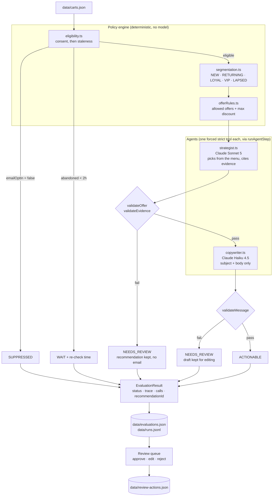

# Architecture

The Cart Win-Back Agent is a linear pipeline in plain TypeScript. Deterministic code decides who may be contacted and what may be offered. Two Claude calls decide which permitted offer fits and how to say it. Deterministic code checks both answers. A marketer decides what happens.

The one-sentence version: **models make judgment and language calls; code enforces every rule that touches money, consent, or eligibility.**

## Pipeline

Every arrow above is a function call in `lib/pipeline.ts`. There is no graph runtime, no message bus, and no agent framework.

## Where responsibility lives

| Layer | Files | Decides | Never decides |
|---|---|---|---|
| Config | `lib/config.ts` | Every number: 2h threshold, segment bands, per-segment menus and caps, blocked phrases, model ids, prices | |
| Policy engine | `lib/policy/*` | Consent, timing, segment, allowed offers, max discount | Which offer, what to say |
| Strategist | `lib/agents/strategist.ts` | Which item on the menu fits, with a reason and cited evidence | Whether the fan may be contacted, the cap, whether an offer type exists |
| Copywriter | `lib/agents/copywriter.ts` | Subject and body | The offer, the discount, anything about the fan it was not given |
| Validators | `lib/validation/*` | Whether each model answer stayed inside policy and inside the data | Nothing is repaired or defaulted; failures are reported |
| Review policy | `lib/reviewPolicy.ts` | Whether a recommendation may be approved at all | |
| Marketer | UI | Approve, edit, reject, re-run | Cannot approve an offer that failed a money check |

## The two model calls

Both go through `runAgentStep` (`lib/agents/runAgentStep.ts`), a single function rather than a framework:

1. Call the model with exactly one tool, `tool_choice` forced to it, `strict: true`, and the tool's input schema generated from the step's Zod schema minus the bounds strict mode rejects (`minimum`, `maximum`, `minLength`, `maxLength`, `pattern`, `maxItems`), which move into field descriptions and are still enforced by the Zod parse in step 2. Only the strategist sets `output_config.effort`; Haiku 4.5 rejects it.
2. Parse the tool input with that Zod schema.
3. On schema failure, retry once with the exact Zod errors returned as an error `tool_result`. A second failure is `MALFORMED_OUTPUT`.
4. Run the step's injected deterministic validators. Any failed check is `VALIDATION_FAILED`; the parsed output is kept so the reviewer can see it. Validator failures are never retried.
5. Return the output or an explicit error, always with token usage, attempt count, latency, prompt version, and raw response blocks.

What each model sees is deliberately narrow:

- The strategist sees the whole cart (nine fields), the segment with its reason, the allowed offers, and the cap. It does not see other segments' menus. A loyal fan's prompt never mentions `PERCENT_DISCOUNT`.
- The copywriter sees seven fields: segment, offer type, discount, seats, section, cart value, hours abandoned. No ids, no purchase history, no consent flag. It cannot write "as one of our most loyal fans" from data it does not have.

## Statuses

| Status | Meaning | Model calls | Marketer can |
|---|---|---|---|
| `SUPPRESSED` | No email consent | 0 | See why. Nothing else. |
| `WAIT` | Under the stale threshold | 0 | See when to re-check |
| `ACTIONABLE` | Offer, evidence, and copy passed every check | 1 or 2 | Approve, edit, reject, re-run |
| `NEEDS_REVIEW` | Something failed: a policy check, a copy check, or the model itself | 0 to 2 | Reject or re-run; approve/edit only if the failure was copy, not money |

`NEEDS_REVIEW` is not an error state hidden from the user. The card shows the exact failed checks and whatever the model proposed.

## Request lifecycle

- `GET /` and `GET /api/evaluate` read `data/evaluations.json` and `data/review-actions.json`. No model is called. Refreshing the page never regenerates anything.
- `POST /api/evaluate {cartId?}` runs the pipeline for one cart or all five, sequentially, writes the last evaluation per cart, appends one line per run to `data/runs.jsonl`, and returns the queue.
- `POST /api/review` records approve / edit / reject against a `recommendationId`. 409 if the recommendation was re-run since the page loaded. 422 if policy blocks approval. Edits are re-checked and returned with warnings, saved either way.

## Persistence and observability

Three JSON files under `data/`, local only, atomic writes, gitignored:

- `evaluations.json`: last evaluation per cart. This is what the UI shows.
- `runs.jsonl`: one append-only line per run: status, models, prompt versions, raw model content blocks, parsed output, validator checks, token counts, latency. Tokens only. `npm run eval:report` prices them at read time from the dated table in `lib/config.ts`, so a price change never rewrites history.
- `review-actions.json`: append-only marketer decisions. The latest per `recommendationId` wins.

## How this design can fail, and what catches it

| Failure | Where it would show | Mitigation in this codebase |
|---|---|---|
| Model invents fan history | Strategist reason or email body | Strategist must cite evidence fields; `validateEvidence` requires exact matches to the cart. Copywriter never receives history fields. Phrase blocklist catches the common tells. |
| Model offers too much | Strategist output | Menu and cap are chosen before the call; `validateOffer` rejects anything outside them; approval of such a result is blocked server-side. |
| Non-consenting fan contacted | Never reaches a model | Consent is the first check, before staleness, before any prompt. |
| Fan contacted mid-checkout | Never reaches a model | 2h threshold; `WAIT` says when to look again. |
| Copy sounds right but is wrong | Email body | Number match (every % and $), literal phrase lists. This is a heuristic and the README says so; "as a season ticket holder" to a first-time buyer is the example it exists for. The marketer is the last check. |
| Model returns garbage or nothing | `runAgentStep` | Strict tool schema, one retry with the errors, then an explicit `MALFORMED_OUTPUT` / `NO_TOOL_CALL`. Never a guess. |
| API down or no key | Any model call | `NEEDS_REVIEW` with `API_ERROR` / `MISSING_API_KEY`. The app, the policy engine, and suppressed/waiting cards work with no key. Nothing pretends a model ran. |
| Marketer approves stale recommendation | `/api/review` | Every action carries the `recommendationId`; a mismatch is 409. |
| Phrase blocklist is bypassed by paraphrase | Email body | Known limitation. Mitigated by narrow copywriter input and human review; an optional tone critic was scoped out. |
| Two servers write the same JSON file | `data/` | Not handled. Single-instance assumption; SQLite is the documented next step if that changes. |
| Price table goes stale | `eval:report`, UI cost | Table is dated and sourced; unknown models price as `null`, never as zero. |

## Evaluation

- `npm test`: 200+ cases, all model calls scripted, free. Golden dataset promises are asserted through the whole pipeline with deliberately bad model replies, so they rest on code, not on the model being well-behaved.
- `npm run eval:live`: real calls, each eligible cart several times. Wording may vary; segment, menu, and cap may not; anything `ACTIONABLE` must pass every validator.
- `npm run eval:report`: tokens, latency, estimated cost per cart and model from the run log.

See [DECISIONS.md](./DECISIONS.md) for why each of these choices was made and [../REDIRECTS.md](../REDIRECTS.md) for where AI suggestions were changed along the way.
